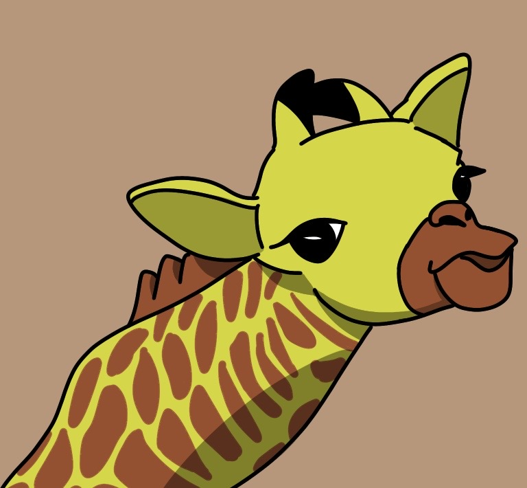

- 그림을 그렸습니다.

* (오류로 인한 링크 첨부)
* (Attach links due to errors)

---

## 기린 (A GIRAFFE)

[GIRAFFE](https://github.com/hoj0610/hoj0610.github.io/blob/master/images-git/%EA%B8%B0%EB%A6%B0%EA%B7%B8%EB%A6%BC.jpg){: .btn}

---

## 알파카 (AN ALPACA)

[ALPACA](https://github.com/hoj0610/hoj0610.github.io/blob/master/images-git/%EC%95%8C%ED%8C%8C%EC%B9%B4%EA%B7%B8%EB%A6%BC.jpg){: .btn}

---

[BACK](https://hoj0610.github.io/posts/){: .btn}
